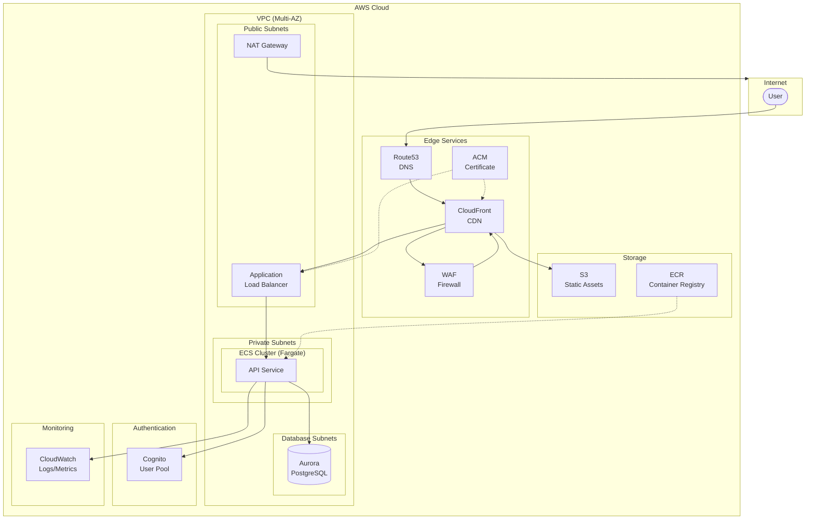
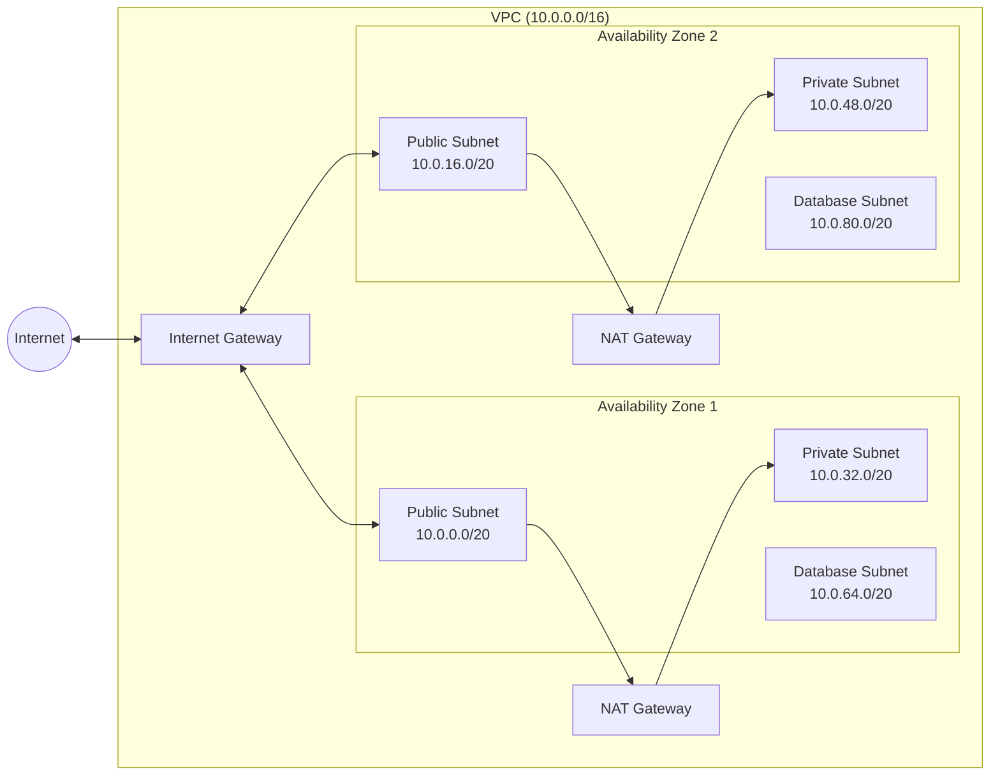
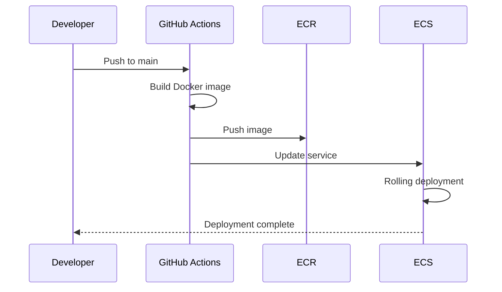
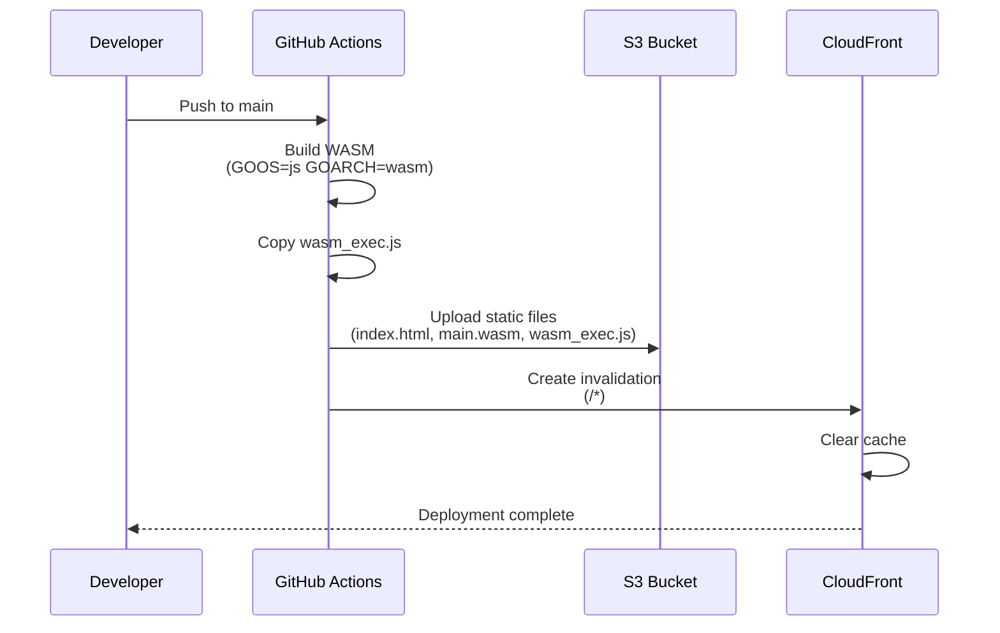
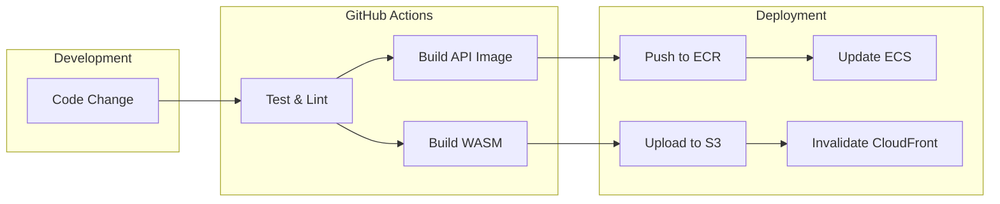

# Infrastructure as Code (Terraform)

AWS インフラストラクチャを Terraform で管理します。

## アーキテクチャ図



## ネットワーク構成



## ディレクトリ構成

```
iac/
├── README.md
├── shared/                          # 共有設定
│   └── outputs.tf                  # 全環境共通の出力定義
│
├── environments/                    # 環境別設定
│   ├── dev/                        # 開発環境
│   │   ├── main.tf                 # モジュール呼び出し
│   │   ├── variables.tf            # 変数定義 (dev 用デフォルト値)
│   │   ├── outputs.tf -> ../../shared/outputs.tf  # シンボリックリンク
│   │   ├── terraform.tfvars.example
│   │   ├── backend.hcl.example     # Backend 設定テンプレート
│   │   └── backend.hcl             # Backend 設定 (要作成、gitignore 対象)
│   ├── stg/                        # ステージング環境
│   │   ├── main.tf
│   │   ├── variables.tf            # 変数定義 (stg 用デフォルト値)
│   │   ├── outputs.tf -> ../../shared/outputs.tf
│   │   └── terraform.tfvars.example
│   └── prd/                        # 本番環境
│       ├── main.tf
│       ├── variables.tf            # 変数定義 (prd 用デフォルト値)
│       ├── outputs.tf -> ../../shared/outputs.tf
│       └── terraform.tfvars.example
│
└── modules/                        # 再利用可能なモジュール
    ├── vpc/                        # VPC, Subnets, NAT Gateway, VPC Endpoints
    │   ├── main.tf
    │   ├── variables.tf
    │   └── outputs.tf
    ├── security-groups/            # Security Groups
    ├── alb/                        # Application Load Balancer
    ├── ecs/                        # ECS Cluster, Service, Task Definition
    ├── ecr/                        # Elastic Container Registry
    ├── aurora/                     # Aurora PostgreSQL Serverless v2
    ├── s3/                         # S3 Bucket
    ├── cloudfront/                 # CloudFront Distribution
    ├── waf/                        # Web Application Firewall
    ├── acm/                        # ACM Certificate
    ├── route53/                    # Route53 Records
    ├── cognito/                    # Cognito User Pool
    └── iam/                        # IAM Roles (GitHub Actions OIDC)
```

## モジュール概要

| モジュール | 説明 |
|-----------|------|
| **vpc** | Multi-AZ VPC、Public/Private/Database サブネット、NAT Gateway、VPC Endpoints |
| **security-groups** | ALB、ECS、Aurora 用のセキュリティグループ |
| **alb** | Application Load Balancer、HTTPS リスナー、ターゲットグループ |
| **ecs** | ECS Fargate クラスター、サービス、オートスケーリング |
| **ecr** | コンテナイメージリポジトリ |
| **aurora** | Aurora PostgreSQL Serverless v2、IAM 認証対応 |
| **s3** | 静的アセット用 S3 バケット、CloudFront OAC 対応 |
| **cloudfront** | CDN、S3 + ALB オリジン、カスタムエラーページ |
| **waf** | AWS Managed Rules、レートリミット |
| **acm** | SSL/TLS 証明書 |
| **route53** | DNS レコード、ACM 検証レコード |
| **cognito** | ユーザー認証、MFA 対応 |
| **iam** | GitHub Actions OIDC、ECS タスクロール |

## 使用方法

### 前提条件

- AWS CLI >= 2.32.0 がインストール済みであること
- Terraform >= 1.0 がインストール済みであること
- Terraform 状態ファイル用の S3 バケットが作成済みであること

```bash
# S3 バケットがない場合は作成
aws s3 mb s3://your-terraform-state-bucket --region ap-northeast-1
```

### 1. AWS 認証設定

#### 方法 A: `aws login` を使用している場合（推奨）

`aws login` コマンドで認証している場合、Terraform は `login_session` 形式を直接サポートしていないため、`credential_process` を使用します。

```bash
# ~/.aws/config に以下を追加
cat >> ~/.aws/config << 'EOF'

# Terraform用のプロファイル
[profile terraform]
credential_process = aws configure export-credentials --profile default --format process
region = ap-northeast-1
EOF
```

これにより、AWS CLI が認証情報を動的に提供し、Terraform が使用できるようになります。

#### 方法 B: AWS SSO を使用している場合

```bash
# SSO でログイン
aws sso login --profile your-sso-profile

# プロファイルを環境変数で指定
export AWS_PROFILE=your-sso-profile
```

#### 方法 C: IAM アクセスキーを使用している場合

```bash
aws configure
# Access Key ID, Secret Access Key, Region を入力
```

#### 認証の確認

```bash
aws sts get-caller-identity
```

### 2. Backend 設定 (S3)

Terraform の状態ファイルを S3 に保存するための設定が必要です。

```bash
cd apps/iac/environments/dev

# backend.hcl を作成
cp backend.hcl.example backend.hcl
```

`backend.hcl` を編集:

```hcl
bucket  = "your-terraform-state-bucket"
key     = "dev/terraform.tfstate"
region  = "ap-northeast-1"
profile = "terraform"  # 1. で設定したプロファイル名
```

### 3. 環境変数の設定 (terraform.tfvars)

`terraform.tfvars.example` をコピーして値を設定:

```bash
cp terraform.tfvars.example terraform.tfvars
```

`terraform.tfvars` を編集:

```hcl
project     = "myapp"
environment = "dev"
aws_region  = "ap-northeast-1"
aws_profile = "terraform"  # 1. で設定したプロファイル名

# Domain
domain_name    = "dev.example.com"
hosted_zone_id = "Z1234567890ABC"

# Database
database_name = "myapp"

# GitHub Actions
github_repository        = "your-org/your-repo"
github_oidc_provider_arn = "arn:aws:iam::123456789012:oidc-provider/token.actions.githubusercontent.com"

# Cognito callback URLs
cognito_callback_urls = [
  "http://localhost:3000/callback",
  "https://dev.example.com/callback"
]

cognito_logout_urls = [
  "http://localhost:3000",
  "https://dev.example.com"
]
```

### 4. Terraform 初期化とデプロイ

```bash
cd apps/iac/environments/dev

# 初期化
terraform init -backend-config=backend.hcl

# 実行計画の確認
terraform plan

# インフラ構築
terraform apply
```

## 主要な変数

| 変数 | 説明 | デフォルト (dev) |
|-----|------|-----------------|
| `vpc_cidr` | VPC CIDR | `10.0.0.0/16` |
| `az_count` | AZ 数 | `2` |
| `single_nat_gateway` | NAT Gateway を 1 つに | `true` |
| `ecs_task_cpu` | ECS CPU | `256` |
| `ecs_task_memory` | ECS メモリ | `512` |
| `aurora_min_capacity` | Aurora 最小 ACU | `0.5` |
| `aurora_max_capacity` | Aurora 最大 ACU | `4` |
| `enable_waf` | WAF 有効化 | `false` |

## 出力値

| 出力 | 説明 |
|-----|------|
| `vpc_id` | VPC ID |
| `ecr_repository_url` | ECR リポジトリ URL |
| `ecs_cluster_name` | ECS クラスター名 |
| `aurora_cluster_endpoint` | Aurora エンドポイント |
| `cloudfront_distribution_id` | CloudFront ID |
| `cognito_user_pool_id` | Cognito User Pool ID |
| `github_actions_role_arn` | GitHub Actions ロール ARN |
| `app_url` | アプリケーション URL |
| `api_url` | API URL |

## 命名規則

リソース名: `${project}-${environment}-${resource}`

例:
- VPC: `myapp-dev-vpc`
- ECS Cluster: `myapp-dev-cluster`
- ALB: `myapp-dev-alb`
- Aurora: `myapp-dev-aurora`

## デプロイフロー

### API (Backend)



### Web (Frontend)



### 全体フロー



## 環境別設定

| 設定 | dev | stg | prd |
|-----|-----|-----|-----|
| VPC CIDR | 10.0.0.0/16 | 10.1.0.0/16 | 10.2.0.0/16 |
| AZ 数 | 2 | 2 | 3 |
| NAT Gateway | 1 | 1 | AZ 数 |
| Aurora インスタンス | 1 | 2 | 3 |
| Aurora min/max ACU | 0.5/4 | 0.5/8 | 2/64 |
| ECS CPU/Memory | 256/512 | 512/1024 | 1024/2048 |
| ECS タスク数 | 1 | 2 | 3 |
| ECS オートスケール | OFF | ON | ON |
| WAF | OFF | ON | ON |
| WAF レートリミット | - | 2000 | 5000 |
| Cognito MFA | OPTIONAL | OPTIONAL | ON |
| Cognito セキュリティ | OFF | AUDIT | ENFORCED |
| 削除保護 | OFF | ON | ON |
| ECS Exec | ON | ON | OFF |
| CloudFront Price Class | PriceClass_200 | PriceClass_200 | PriceClass_All |

## セキュリティ

- **VPC Endpoints**: S3, ECR, CloudWatch Logs, Secrets Manager へのプライベート接続
- **IAM 認証**: Aurora への接続に IAM Database Authentication を使用
- **WAF**: AWS Managed Rules + レートリミット (stg/prd)
- **セキュリティグループ**: 最小権限の原則
- **暗号化**: S3, Aurora, CloudWatch Logs

## コスト最適化 (開発環境)

| 設定 | 効果 |
|-----|------|
| `single_nat_gateway = true` | NAT Gateway を 1 つに削減 |
| `aurora_min_capacity = 0.5` | Aurora Serverless の最小容量 |
| `aurora_instance_count = 1` | インスタンス数を最小化 |
| `enable_waf = false` | WAF 無効化 |
| `ecs_enable_autoscaling = false` | オートスケール無効化 |
